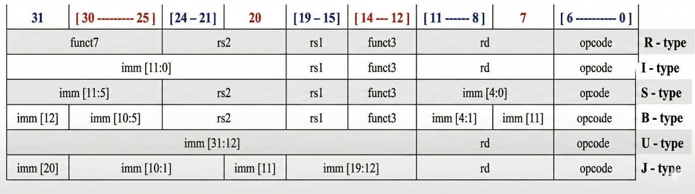
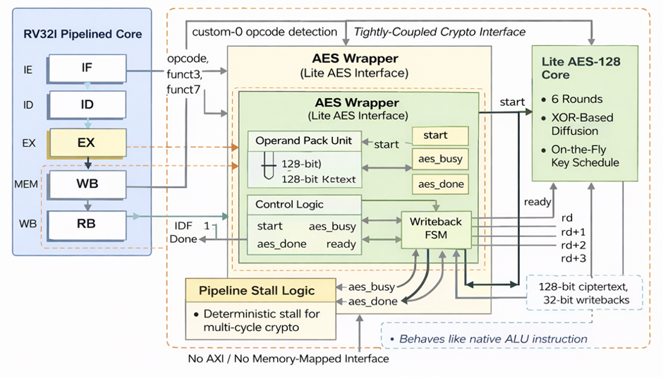

# RISC-V Crypto Co-Processor

A custom **32-bit 5-stage pipelined RISC-V processor** integrated with a **lightweight cryptographic co-processor**, developed entirely in **Verilog HDL**.

This repository presents the complete RTL implementation of a pipelined RISC-V processor tightly coupled with a lightweight AES-based cryptographic accelerator. The design targets secure embedded and edge computing applications by accelerating cryptographic operations while preserving the standard processor pipeline.

---

# System Architecture

The pdf below illustrates the high resolution complete processor architecture, showing the integration of the five-stage RISC-V pipeline with the custom cryptographic co-processor.

📄 [RISC-V CPU RTL Schematic (PDF)](doc/images/schemtic.pdf)

---

# Supported Instruction Formats

The processor follows the standard **RV32I RISC-V instruction encoding**, supporting the fundamental instruction formats required for arithmetic, logical, memory access, control flow, and immediate operations.

The implemented instruction formats include:

- **R-Type** – Register-to-register arithmetic and logical operations
- **I-Type** – Immediate arithmetic, loads, and JALR instructions
- **S-Type** – Store instructions
- **B-Type** – Conditional branch instructions
- **U-Type** – Upper immediate instructions (LUI/AUIPC)
- **J-Type** – Unconditional jump (JAL)

The figure below summarizes the bit-field organization of each RV32I instruction format used by the processor.

<p align="center">
    
</p>

The cryptographic instructions are integrated through a custom-0 opcode that follows R type instruction, for encryption. Preserving compatibility with the standard RV32I instruction encoding, enabling seamless interaction between the processor pipeline and the AES co-processor.

---

# Features

- 32-bit RISC-V Processor
- Five-stage pipelined architecture
- Lightweight AES Cryptographic Co-Processor
- Tight processor-accelerator integration
- Hazard Detection Unit
- Data Forwarding Unit
- Modular RTL implementation
- Verilog HDL based design
- Hierarchical project organization

---

# Processor Pipeline

The processor follows the classic five-stage RISC-V pipeline.

| Stage | Description |
|-------|-------------|
| **Instruction Fetch (IF)** | Fetches instructions and updates the Program Counter |
| **Instruction Decode (ID)** | Decodes instructions, reads register operands and generates control signals |
| **Execute (EX)** | Performs ALU operations, branch evaluation and cryptographic instruction execution |
| **Memory (MEM)** | Executes load/store operations through Data Memory |
| **Write Back (WB)** | Writes computation results back into the Register File |

---

# Supported Directory Structure

```text
rtl/
├── cpu/
│   ├── cpu_top/
│   ├── fetch/
│   ├── decode/
│   ├── execute/
│   ├── memory/
│   ├── writeback/
│   └── hazard_unit/
│
└── crypto/
```

Each directory contains its own documentation describing the RTL implementation, internal architecture and constituent modules.

---

# Crypto Co-Processor

The processor integrates a lightweight cryptographic co-processor through a tightly coupled interface rather than using memory-mapped communication.

The accelerator supports:

- Lightweight AES Encryption
- Custom Crypto Instruction Interface
- Busy/Done Handshake Protocol
- Pipeline Stall Logic
- Native Processor Integration

The internal RTL architecture of the crypto accelerator is documented under:

```text
rtl/crypto/
```

---

# Cryptoprocessor Interface

The following waveform demonstrates the interaction between the processor and the cryptographic accelerator.

The processor issues an encryption request through **aes_start**, the accelerator enters the **aes_busy** state while computation is performed, and finally returns the encrypted ciphertext after completion.

<p align="center">
  
</p>

---

# Project Organization

The repository has been organized hierarchically for easier navigation.

```text
RISC-V-Crypto-CoProcessor/
│
├── docs/
│   └── images/
│
├── rtl/
│   ├── cpu/
│   │   ├── fetch/
│   │   ├── decode/
│   │   ├── execute/
│   │   ├── memory/
│   │   ├── writeback/
│   │   ├── hazard_unit/
│   │   └── cpu_top/
│   │
│   └── crypto/
│
└── memory/
```

The Crypto Coprocessor repository have its own README containing:

- Working Flowchart
- Simulation
- Design Notes

---

# Development Tools

- Verilog HDL
- Xilinx Vivado
- Quartus II

---

# Author

**Ishan Upadhye**

M.Tech – VLSI Design

---

# License

This project is released for educational and research purposes.
